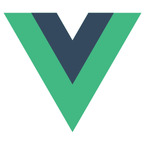

<!-- Header with Animated Text -->

  

<!-- Profile Views Counter -->

  

---

## 🚀 About Me

🔭 **Full-Stack Developer** passionate about creating innovative web applications and tools  
🌟 **Template Creator** with 37+ stars on [shadcn-sveltekit-landing-page](https://github.com/Zxce3/shadcn-sveltekit-landing-page)  
🌐 **Domain Owner** of [zxce3.net](https://zxce3.net) with multiple active projects  
💻 **69+ Repositories** showcasing diverse technical skills  
🇮🇩 **Based in Indonesia** contributing to the global developer community  

---

## 🛠️ Tech Stack

### Frontend Development

  
  
  
  
  
  
  
  
  

### Backend Development

  
  
  
  
  
  

### Databases & Tools

  
  
  
  
  
  
  
  

---

## 📊 GitHub Analytics

  

  
  

  

---

## 🌟 Featured Projects

### 🎨 [ShadCN SvelteKit Landing Page](https://github.com/Zxce3/shadcn-sveltekit-landing-page)
**37+ ⭐ | Template | SvelteKit + Shadcn + TypeScript + Tailwind**  
*Modern landing page template with beautiful design and developer experience*

### 📚 [WakaWiki](https://github.com/Zxce3/wakawiki)
**Wikipedia TikTok Style | SvelteKit + TypeScript**  
*Innovative way to consume Wikipedia content in a TikTok-style interface*

### 🐧 [Perintah Linux](https://github.com/Zxce3/perintah-linux)
**Linux Commands in Indonesian | Jekyll + SCSS**  
*Comprehensive Linux command reference for Indonesian developers*

### 🎮 [Pixel Game SvelteKit](https://github.com/Zxce3/pixel-game-sveltekit)
**Browser Game | SvelteKit + TypeScript + WebWorker**  
*Engaging pixel-based game with terrain exploration mechanics*

---

## 🎯 Recent Activities

<!--START_SECTION:activity-->
- 🔨 Working on modern web applications with SvelteKit
- 🌟 Maintaining open-source templates and tools
- 📝 Contributing to the Indonesian developer community
- 🚀 Exploring new technologies and frameworks
<!--END_SECTION:activity-->

---

## 📈 Contribution Graph

  

---

## 🏆 Achievements

  

---

## 🌐 Connect with Me

  

---

## 💡 Quick Facts

- 🔭 Currently working on: **Modern SvelteKit applications**
- 🌱 Learning: **Advanced TypeScript patterns and 3D web graphics**
- 👯 Looking to collaborate on: **Open source projects and innovative web apps**
- 💬 Ask me about: **SvelteKit, JavaScript, Python, and modern web development**
- ⚡ Fun fact: **I built an OS that only plays Tetris!**

---

  
### "Code is like humor. When you have to explain it, it's bad." 💻

**Thanks for visiting! 🚀**

